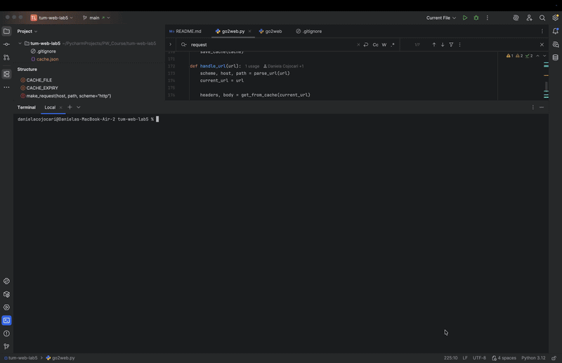

# Lab 5 - HTTP over TCP Sockets

A command line HTTP client built on raw TCP sockets 

## Usage
```bash
go2web -u <URL>         # make an HTTP request to the specified URL and print the response
go2web -s <search-term> # search using DuckDuckGo and print top 10 results
go2web -h               # show help
```

## Demo



## Features

- **`-u`** — fetches any URL over raw TCP sockets, supports HTTP and HTTPS
- **`-s`** — searches DuckDuckGo and returns top 10 results with full clickable URLs
- **Human-readable output** — HTML tags are stripped, JSON is pretty-printed
- **Redirects** — automatically follows 301 and 302 redirects
- **Cache** — responses are cached for 1 hour in `cache.json`
- **Content negotiation** — accepts and handles both JSON and HTML responses


## Implementation Details

- Built with Python using only `socket` and `ssl` for networking
- HTML parsing via `BeautifulSoup4`
- File-based cache stored in `cache.json`
- Supports chunked transfer encoding

